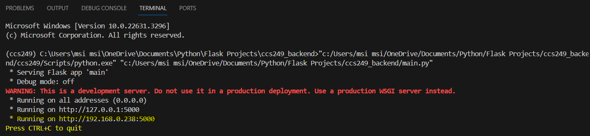

# Create an environment first before installing and running your flask app.
# If you want to include Machine Learning techniques, please create a separate file, and then call it on the main.py file

Note when running flask app:
    1. Make sure to take note of the URL given if you are planning to create a separate codebase for your frontend, 
    

    You will use this as your endpoint.

    2. This URL will depend on the device's IPv4 address, and by default it is set to dynamic.